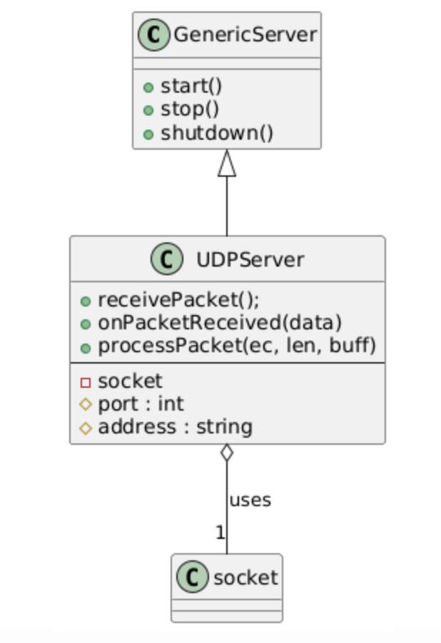
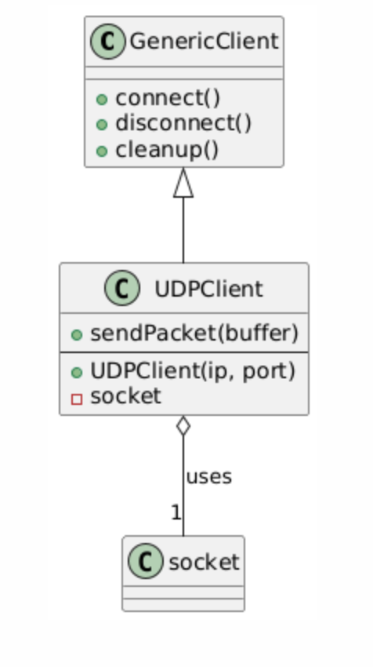

# Sender/Receiver  App based on UDP

## Table of Contents

- [Dependencies](#dependencies)
- [Project Structure](#project-structure)
- [Setup](#setup)
- [Build Steps](#build-steps)
- [Running the Sender/Receiver apps](#running-the-senderreceiver-apps)
  - [Receiver App](#receiver-app)
  - [Sender App](#sender-app)
- [Protocol](#protocol)
- [Timestamps File](#timestamps-file)
- [Design Philosophy](#design-philosophy)
  - [Abstractions](#abstractions)
    - [Server](#server)
    - [Client](#client)
- [Tests](#tests)
- [Ideas](#ideas-for-better-design)

## Dependencies

1. CMake ver  3.27 or higher
2. Boost 1.82 

The project will be built with atleast C++17.

## Project Structure

Project has the following folder structure:
```
├── cmake/
├── external/
├── modules/
├── CMakeLists.txt
├── build.sh
```

Project dependencies need to go into the **external** folder. 
<br>
For now, only the contents of the Boost libraries are required.

Inside the **modules** folders are all the modules and artifacts that will be built by the project.
<br>There are four main modules which are built:

```
├── modules/
│   ├── app_receiver/
│   ├── app_sender/
│   ├── client/
│   └── server/
```
All exeutable targets are prefixed with "app_".  As you can see the two apps for sender and receiver.
While all other modules are built into static library targets.

Every module internally should contain the following structure for source files: 

```
├── <module-name>/
│   ├── include/
│   ├── src/
│   └── CMakeLists.txt
```

This modular structure ensures smaller artifact sizes and smaller compile and build times, should the project size grow.

## Setup

If you have'nt already copied boost into the project, you can use the following script to automate this step:

Simly run the ./download-dependecy.sh script from project root, it will downlaod and extract boost correctly as is required by the build step:

```
./download-dependecy.sh
```

The boost libraries will be downlaoded from the url :

```
https://archives.boost.io/release/1.82.0/source/boost_1_82_0.tar.gz 
```
The contents of .tar.gz file will ne extracted into the "external" folder such that the final structure looks like below:

```
├── external/
│   ├── boost_1_82_0/
```

## Build Steps

If all dependencies are downloaed and ready, then the project can then be built with **build.sh** script:

First go to the project's root directory:
```
cd <project-root>
```

And simply run the script below:
```
./build.sh
```

Aletrnatively, you can directly use CMake using commands below:

```
cmake -S . -B build
cmake  --build build
```

Once built, the projects artifacts will be ready in the following folder:

```
 ./build/modules/
 ```

## Running the Sender/Receiver apps
Once built, the artifacts for sender and reciever app will be avialable inside: ./build/modules

#### Receiver App
First run the Receiver app (which is a UDP Server):

```
./build/modules/app_receiver/ReceiverApp ~/Downloads/received.bin 12345
```
The first paramter is the received file path and second is port number.
<br>
On succesfull run you should see: 
```
UDPServer started on port 12345
```

Once the receiver starts receiving packets from the client it will output how many packets it has received like this: 

```
╰─ ./build/modules/app_receiver/ReceiverApp ~/Downloads/received.bin 12345

UDPServer started on port 12345
Received packet of size: 6
Received packet of size: 32
Received packet of size: 9
Received packet of size: 707
Received packet of size: 440
Received packet of size: 309
Received packet of size: 314
Received packet of size: 748
Received packet of size: 1024
Received packet of size: 1024
Received packet of size: 1024
Received packet of size: 1024
Received packet of size: 1024
Received packet of size: 1024
Received packet of size: 1024
Received packet of size: 173
Received packet of size: 1024
Received packet of size: 1024
Received packet of size: 1024
Received packet of size: 1024
Received packet of size: 1024
Received packet of size: 1024
Received packet of size: 1024
Received packet of size: 1024
Received packet of size: 1024
Received packet of size: 1024
Received packet of size: 857
End of file received!

UDPServer stopped.

UDPServer shutdown complete.
Received packet of size: 3

UDPServer shutdown complete.
```

#### Sender App
Then run the Sender app like:
```
./build/modules/app_sender/SenderApp front_0_.bin localhost 12345
```
The sender will start reading chunks of file and start tranfering to the server. Once all the file chunks are sent the client will close the connection. 

On successfull connection with the Receving server, first you will see a connection successfull message like below:
```
Connected to 127.0.0.1:12345
```

And then the client will immediately start sending file chunks to the server:
```
╰─ ./build/modules/app_sender/SenderApp ~/Downloads/front_0_2.bin localhost 12345
Connected to 127.0.0.1:12345
Read chunk of size: 6
Read chunk of size: 32
Read chunk of size: 9
Read chunk of size: 707
Read chunk of size: 440
Read chunk of size: 309
Read chunk of size: 314
Read chunk of size: 748
Read chunk of size: 7341
Read chunk of size: 11097
All frames sent.
```


## Protocol

The client reads the file in the following way: 

First 4 bytes are read, which gives the length N1 of the Frame-1.
<br>
Then next 4 bytes are read, which gives the length N2 of the Frame-2.
<br>
And so on.

This is shown in the diagram below:

 ```
+------------+-----------------------------+
| 4-byte     |      Frame Data (N1 bytes)   |
| Header     |      (variable length)      |
+------------+-----------------------------+
| 4-byte     |      Frame Data (N2 bytes)   |
| Header     |      (variable length)      |
+------------+-----------------------------+
......
+------------+-----------------------------+
| 4-byte     |  Last Frame Data (N bytes)  |
| Header     |      (variable length)      |
+------------+-----------------------------+

+------------+
| 3-byte     |
| EOF        |
+------------+

 ```

Each data-unit is read and sent to the server every 10ms.
<br>When the entire File is read, the client sends a last **3-byte** datagram with **"eof"**, indicating that end of file is reached.

The Receiver end is configured to receive a **Maximum Packet Size of 1024 bytes.**  
If a Data Frame Unit is larger than Max_Packet_Size, then that data-unit is fragmented into smaller packets of  1024. 

This is also hardcoded on the Client end (i.e. the Sender). 

These fragmented packets are sent at a much smaller time-interval than 10ms ( about 3ms, this value should be adjusted based on network congestion).

## Timestamps File

Here is the sample from the timestamps log file created when the Receiver received the packets shown above in [ Receiver App](#receiver-app) section.

The server creates this timestamps.txt file in the folder from where the receiver application was run.
As you can see below the timestamps are almost 10ms +/- 2ms apart. 
When a larger Video Data Unit is received it is fragmented into smaller 1024 sized datagrams.

```
1751528524210
1751528524222
1751528524233
1751528524246
1751528524259
1751528524272
1751528524284
1751528524296
1751528524308
1751528524312
1751528524316◊
1751528524320
1751528524323
1751528524327
1751528524331
1751528524335
1751528524350
1751528524354
1751528524358
1751528524362
1751528524366
1751528524370
1751528524373
1751528524377
1751528524381
1751528524385
1751528524389
1751528524405
```

## Design Philosophy

### Abstractions
The design is based on following abstractions:

#### Server 
A server is the entity which will wait and listen for connections over the internet.
<br>It must perform the following basic actions:

- **Start Listening**: It must start listening for connections over the internet. To be able to do that it most definitely has to acquire the Socket resources from the OS. So it must initialize and acquire the socket resource and start listening for connections on some specific Port. The connections can be made over TCP, UDP  or any other protocol depending on the system needs.

- **Stop Listening**: It should be able to stop listening for connections and terminate existing connections, so it can prepare for shutting itself down.

- **Shutdown**: It should safely return acquired resources like Sockets, file-handlers etc. back to the system in a clean manner. After this call the object will need to be re-initialized/re-created.

#### Client
The client is the entitiy whose sole purpose is to establish connection with the Server.

- **Connect**:  To be able to conenct to the serve it **must** know the **iP address** and **Port** to connect on. It should also know what protocol is supported by the server and be able to connect over that.

- **Disconnect**:  It should be able to terminate its current connection and re-connect if desired.

- **Cleanup**: It should safely return acquired resources like Sockets, file-handlers etc. back to the system in a clean manner. After this call the object will need to be re-initialized/re-created.

Based on these Ideas the current design looks like this. 

There is a GenericServer and GenericClient interface which enforces the design constraints above. The more specialised clients and servers like UDP or TCP will support more specialized implementations of their concrete classes.





## Tests

There is support for tests added using Googles Testing Framework. 

e.g. The sevrer module has tests which can be run using cTests: 

```
ctest --test-dir build -V
```


## IDEAS For BETTER Design

### Policy Based Design

### Composition Based

```cpp
class IServerLifecycle { /* as above */ };

class TCPServerLifecycle : public IServerLifecycle { /* ... */ };
class UDPServerLifecycle : public IServerLifecycle { /* ... */ };

class Server {
    std::unique_ptr<IServerLifecycle> lifecycle_;
public:
    Server(std::unique_ptr<IServerLifecycle> lifecycle)
        : lifecycle_(std::move(lifecycle)) {}

    void start() { lifecycle_->start(); }
    void stop() { lifecycle_->stop(); }
    void shutdown() { lifecycle_->shutdown(); }
};```
